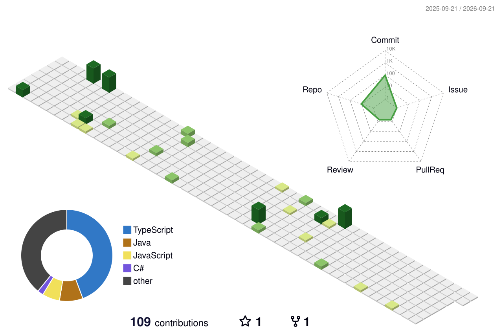

# Olá, eu sou o Vinícius Reis Zimmermann! 👋

### Full Stack Developer 

Atualmente focado em desenvolvimento Full Stack com Java, Typescript, Python e outras tecnologias construindo aplicações web modernas e aplicando boas práticas de arquitetura e engenharia de software.

---

### 💻 Sobre Mim

- 🎓 Graduado em Análise e Desenvolvimento de Sistemas (Vianna Júnior).
- 📚 Pós-graduando em Engenharia de Software com Java (Instituto Infnet).
- 🛠️ Desenvolvi o projeto Zimmermann Automotiva, um sistema de ecommerce automotivo utilizando Spring Boot e React.
- 🛠️ Desenvolvi o projeto ABase, um sistema de gestão administrativa com Typescript com Express e React.
- 🏢 Experiência com digitalização de processos operacionais e gestão administrativa.
- 🚀 Em constante evolução técnica com foco em, arquitetura de software e desenvolvimento de aplicações escaláveis

## 🛠️ Tecnologias e Ferramentas

### Backend
- Java
- Typescript
- Express
- Node
- NestJS
- Sequelize
- Prisma
- Spring Boot
- Spring Security
- Hibernate / JPA
- REST APIs
- JWT Authentication
- Maven

### Frontend
- React
- Next.js
- TypeScript
- JavaScript
- Tailwind CSS
- HTML5 / CSS3

### Banco de Dados
- PostgreSQL
- MySQL
- SQlite
- NoSQL
- SQL Server
- MongoDB

### DevOps & Ferramentas
- Docker
- Git & GitHub & GitLab
- AWS
- Vercel
- Netlify
- SupaBase
- Jenkins
- Grafana
- Prometheus
- JMether
- SonarQube
- Kubernetes
- Postman
- Terraform
- Linux

### Boas Práticas & Arquitetura
- Clean Code
- SOLID
- Arquitetura em Camadas
- Arquitetura Monolitica
- Arquitetura de Microserviços
- Desing Patterns
- Domain Driven Design
- Test-Driven Development
- System Design
- Desenvolvimento Agil
- Versionamento Git

### 🚗 Zimmermann Automotiva

Sistema completo para gerenciamento e venda de autopeças.

Funcionalidades
Autenticação JWT
Dashboard administrativo
Controle de estoque
Cadastro de produtos
Integração com WhatsApp
APIs REST organizadas em camadas

### 🏢 ABase

Sistema voltado para digitalização e organização de processos administrativos para gestão de ONG.

Funcionalidades
Organização de processos internos
Gerenciamento de dados
Estruturação operacional

---

### 🎯 Objetivos de Estudo
Arquitetura backend com Spring
Microsserviços com Spring Cloud
Deploy e infraestrutura com Docker e AWS
Testes automatizados
CI/CD e boas práticas DevOps

---

### 📫 Conexão
- **LinkedIn:** [Vinícius Reis Zimmermann](https://www.linkedin.com/in/vin%C3%ADcius-reis-zimmermann-1774a82b8/)
- **E-mail:** vinirz17@gmail.com

---

### 📊 Minhas Atividades no GitHub

  

  

### 🛠️ Toolbox de Tecnologias

  

